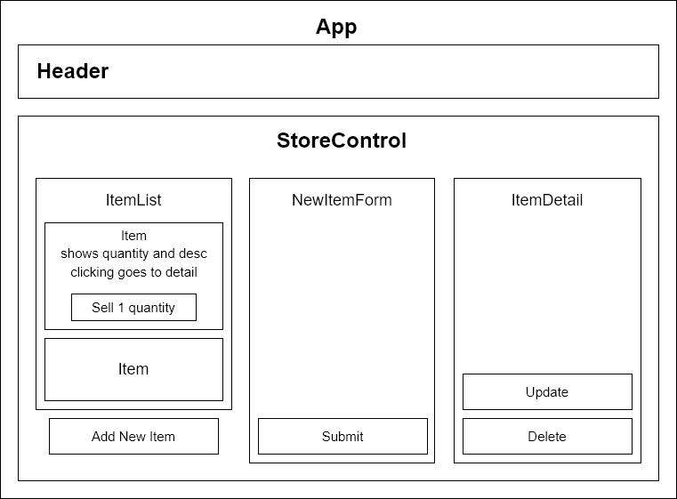

# Coffee and Coffee Related Stuff Inventory Tracker

#### By _Seung Lee_

#### _A simple webpage that keeps track of inventory._

## Technologies Used

* _HTML_
* _JavaScript_
* _React_
* _CSS_

## Description

A simple coffee inventory tracker.

## Component Tree

## Setup/Installation Requirements
_Requires console application such as Git Bash, Terminal, or PowerShell_

1. Open Git Bash or PowerShell if on Windows and Terminal if on Mac
2. Run the command

    ``git clone https://github.com/leark/inventorytracker.git``

3. Run the following command in the console

    ``cd inventorytracker``

4. Run the following command in the console

    ``npm build``

5. Run the following command in the console

    ``npm start``

## Known Bugs

* _No known issues_

## License

[GNU](/LICENSE)

Copyright (c) 2022 Seung Lee